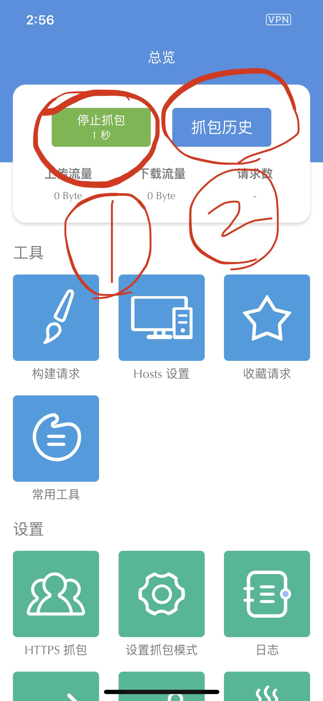
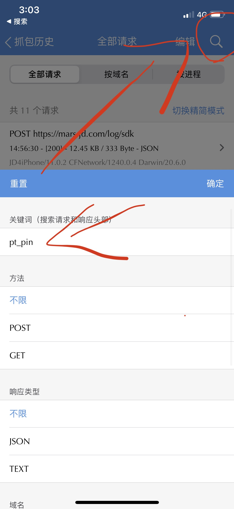
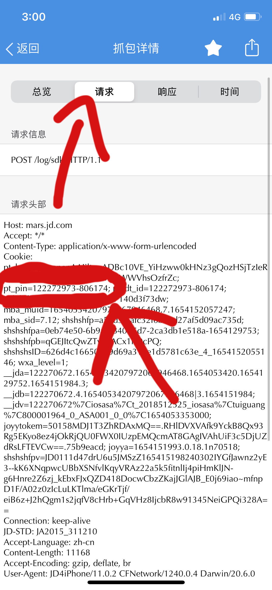
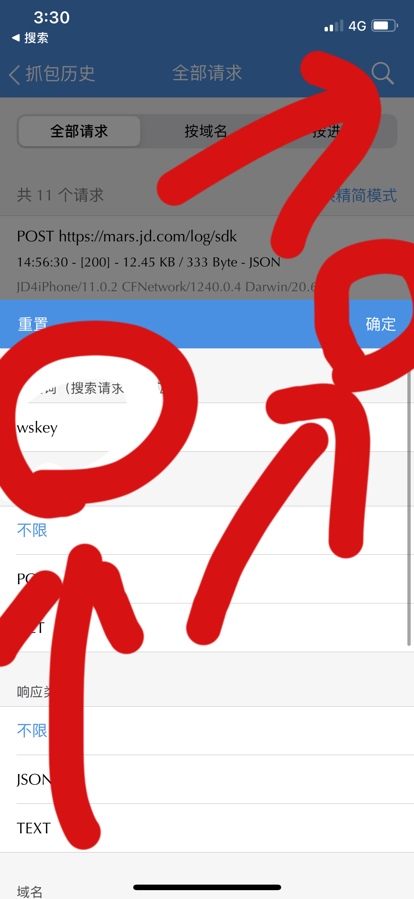
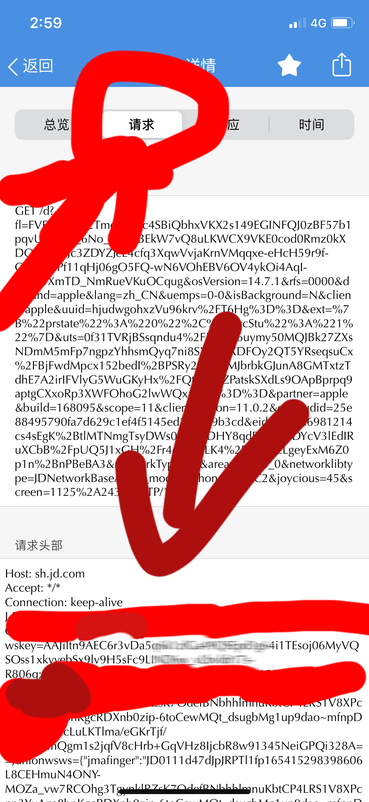
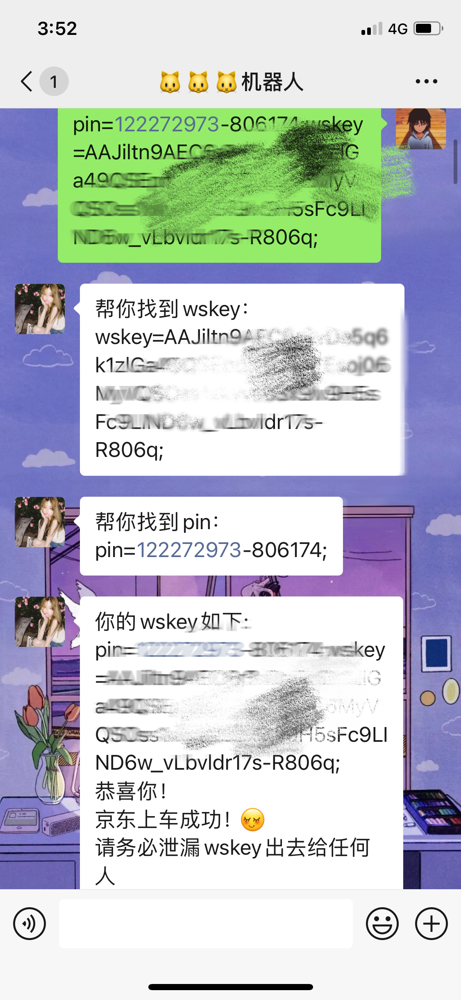

**步骤1 启动抓包**，下图点击圈1开始抓包

启动以后打开app，滑来滑去几十秒

## 步骤2:  抓京东的pin

然后回来stream，关闭抓包，找到上图的抓包历史

点击搜索，输入pt\_pin

这个时候随便点击一个抓包请求点进去，如下图所示

复制圈中内容

例如:    pt\_pin=122272973-6464846;&#x20;

## 步骤3:  抓wskey

下图同理搜索wskey

随便点开一个包，如下图所示

复制圈内内容的wskey

例如:

wskey=AAJiltn9AEC6r3vDa5q6k1zlGa49QSEpd3g64i1TEsoj06MyVQSOss1xkvvebSx9lv9H5sFc9LIND6w\_vLbvldr17s-R806q;

## 将前面的pin➕wskey拼起来

例如:

**pt\_pin=122272973-6464846;wskey=AAJiltn9AEC6r3vDa5q6k1zlGa49QSEpd3g64i1TEsoj06MyVQSOss1xkvvebSx9lv9H5sFc9LIND6w\_vLbvldr17s-R806q;**

#### 这样复制给🐱🐱🐱机器人即可

#### 提示如上图所示，则为成功

# 其他抓包软件同理！！
