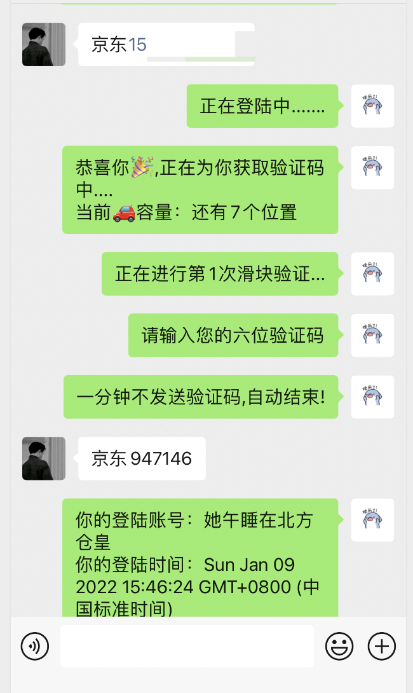

京东上车   注意中间要有任何的空格！！
步骤1、"京东"➕手机号
步骤2、"京东"➕6位验证码
非不要步骤3、"身份"➕前2+后4身份证

私聊，机器人🤖就可以。

注意看清楚每个字再start！

例子：登陆：**京东18911883332**

最后发送信息验证 ：京东123333

ps：注意京东俩字后面不需要加空格直接加手机号

图文例子

需要注意京东俩字，否则没有反应

# 京东身份验证提示

> 最后最后提示如果机器人京东需要身份验证

则发送    **身份证的前2位＋后四位**数字

还要加上     "**身份**"这俩个字

例如 

> **身份443814**

# 不懂的看下图操作！👇

