> 📌使用局限：仅限于之前上过车的。(比如之前在机器人🐱🐱🐱短信登录过或网页登录过或自己提交过wskey)

> 目录（寻找对应自己的即可）

1.  安卓和ios的wifi配置以及验证配置成功
2.  安卓系统
3.  鸿蒙系统
4.  安卓鸿蒙ca证书安装步骤
5.  ios系统
6.  成功截图
7.  注意事项

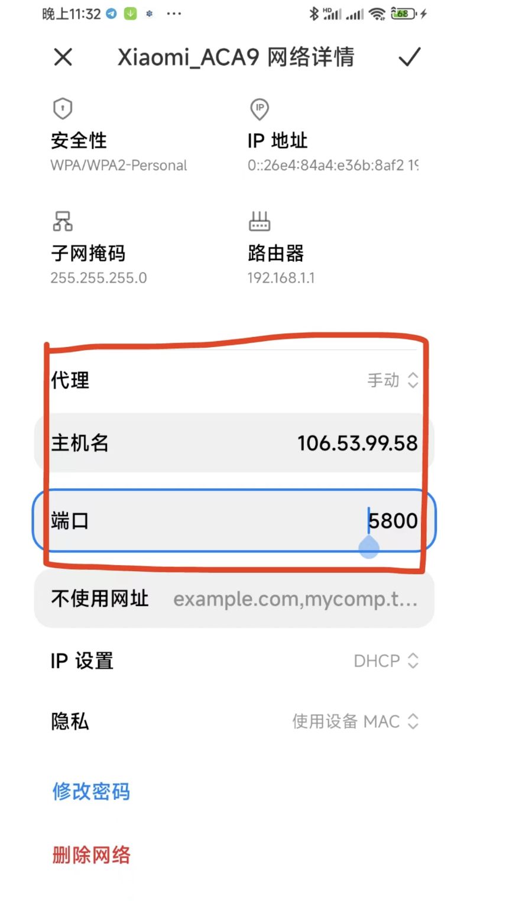

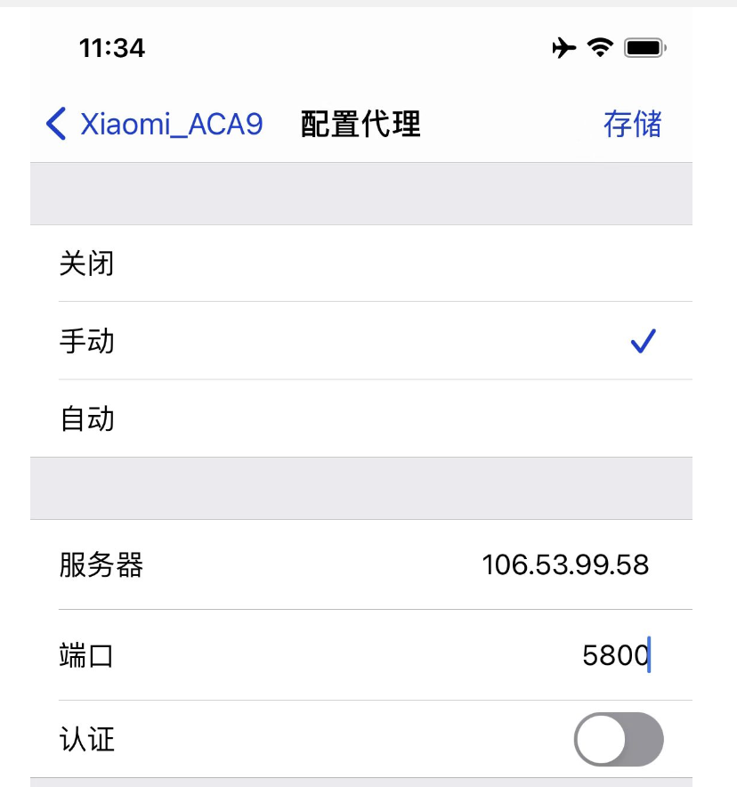

> 📌如果填写完上述信息，打开京东app网络，打开其他app没有网络。恭喜你💐！代表你的http配置成功了！请继续前往安装ca证书的操作！

# 1、安卓系统

## 安装android的ca证书👇🏻

[cer-3.crt](../file/cer-3_io_Mz9Xd2g.crt)

```go
❏ Android/鸿蒙 系统:
·设置WiFi - HTTP手动代理
  服务器: 106.53.99.58
  端  口: 5800
·浏览器打开http://mitm.it
·下载Android系统证书
·👇🏻安装ca证书（看步骤4）
·打开京东APP
·浏览京东，随便刷刷
·如果成功了！机器人会自动发送信息给你！！


❏ ♨️Android/iOS Socks:
·浏览器打开(ios自行解决APP下载或者使用上方HTTP代理方式)
  https://wwc.lanzouy.com/iOfSax17d7g
·安装后打开右上角->添加节点->手动添加->协议:socks
  服务器: 106.53.99.58
  端  口: 5800
·保存->选择添加的节点->启动代理
·打开京东APP
·浏览京东，随便刷刷
·如果成功了！机器人会自动发送信息给你！！

以上两种代理方式请注意看说明
‼️最后记得把WiFi代理关闭‼️
‼️最后记得把WiFi代理关闭‼️
‼️最后记得把WiFi代理关闭‼️
```

# 2、鸿蒙系统

## 安装鸿蒙的ca证书👇🏻

[cer-3.crt](../file/cer-3_io_Mz9Xd2g.crt)

```go
❏ 华为鸿蒙 系统:
·设置WiFi - HTTP手动代理
  服务器: 106.53.99.58
  端  口: 5800
·下载Android系统证书
·👇🏻安装ca证书（看步骤4）
·打开京东APP
·浏览京东，随便刷刷
·如果成功了！机器人会自动发送信息给你！！

‼️最后记得把WiFi代理关闭‼️
‼️最后记得把WiFi代理关闭‼️
‼️最后记得把WiFi代理关闭‼️

```

# 3、安卓鸿蒙ca证书安装步骤

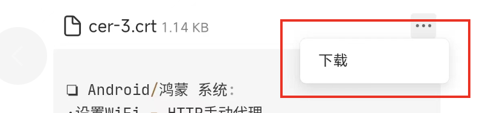

> 📌打开设置！搜索ca，如下图！找到ca证书！

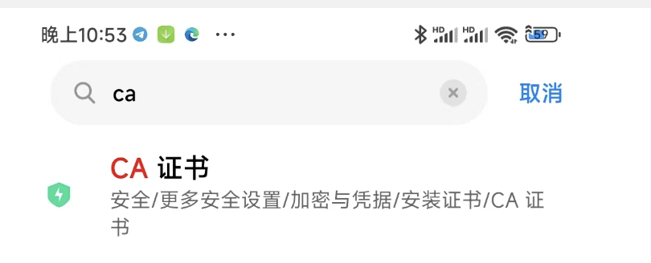

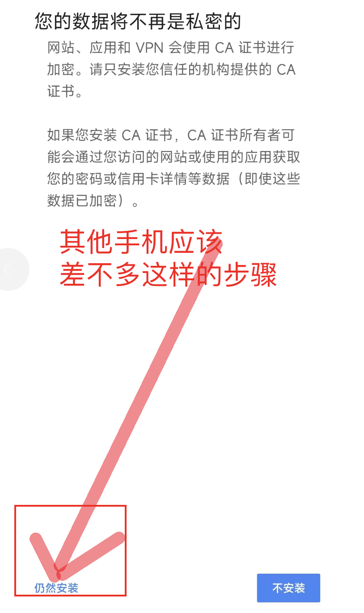

> 📌在文件中你的证书，点击，然后就会显示安装成功了！

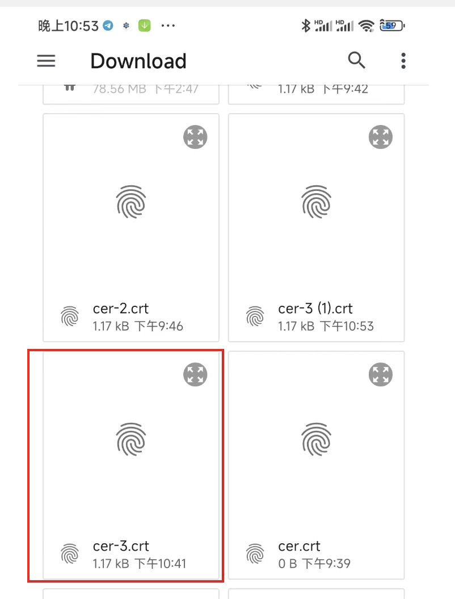

# 4、ios

## 安装iphone的ca证书

[pem-1.crt](../file/pem-1_uJkKkBVJ82.crt)

###

1.  首先把ca证书下载
2.  保存到『文件』app
3.  打开『文件』app
4.  找到ca证书
5.  点击安装ca证书即可

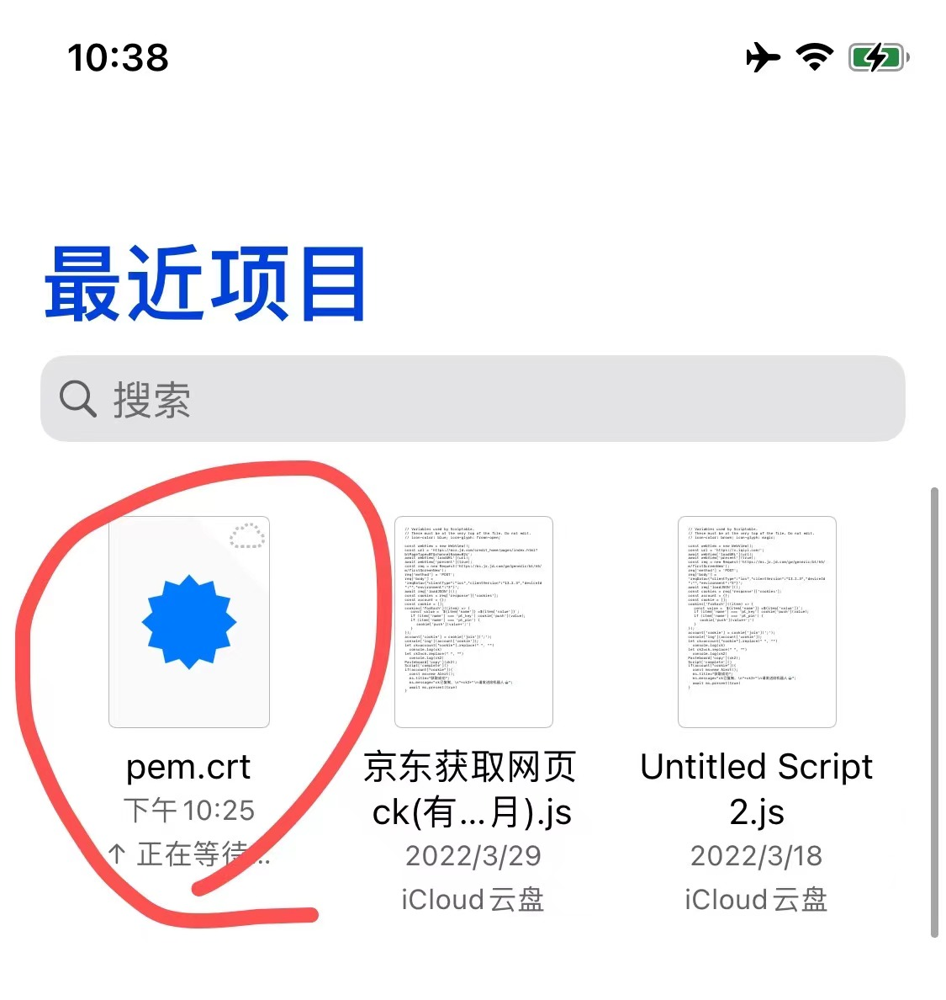

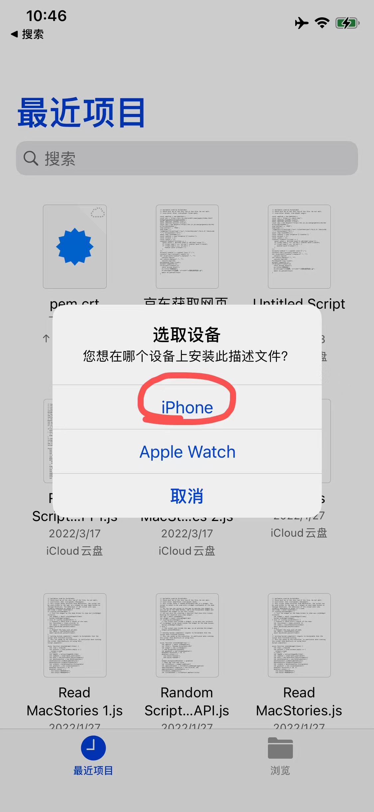

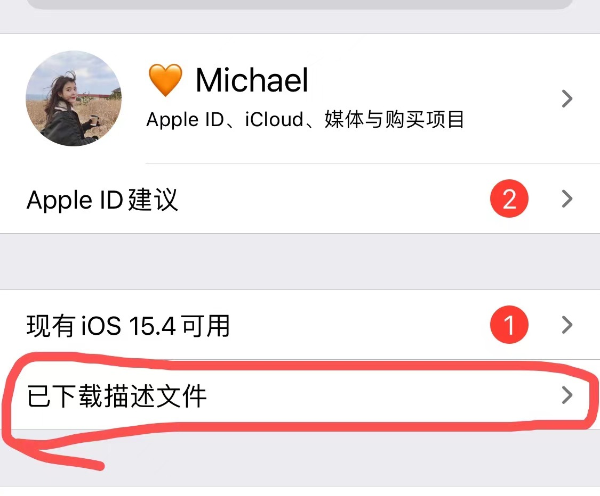

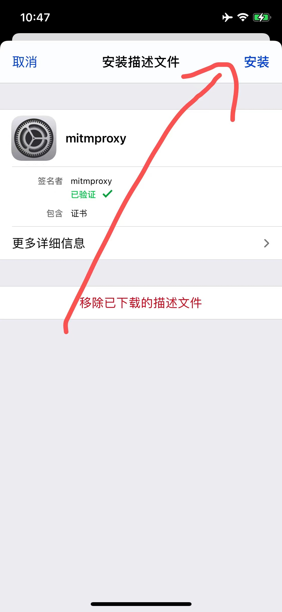

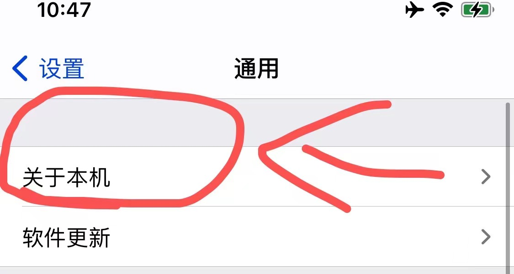

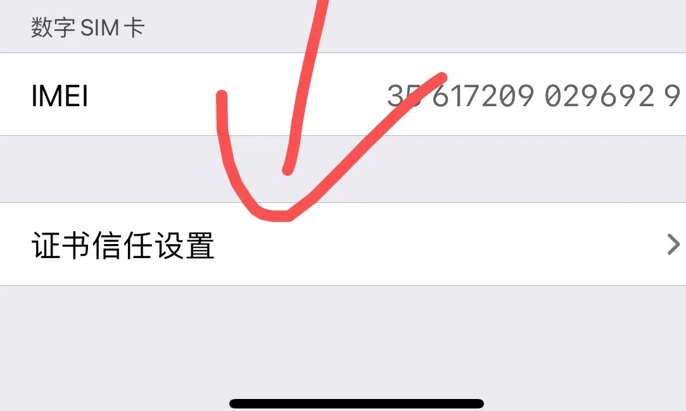

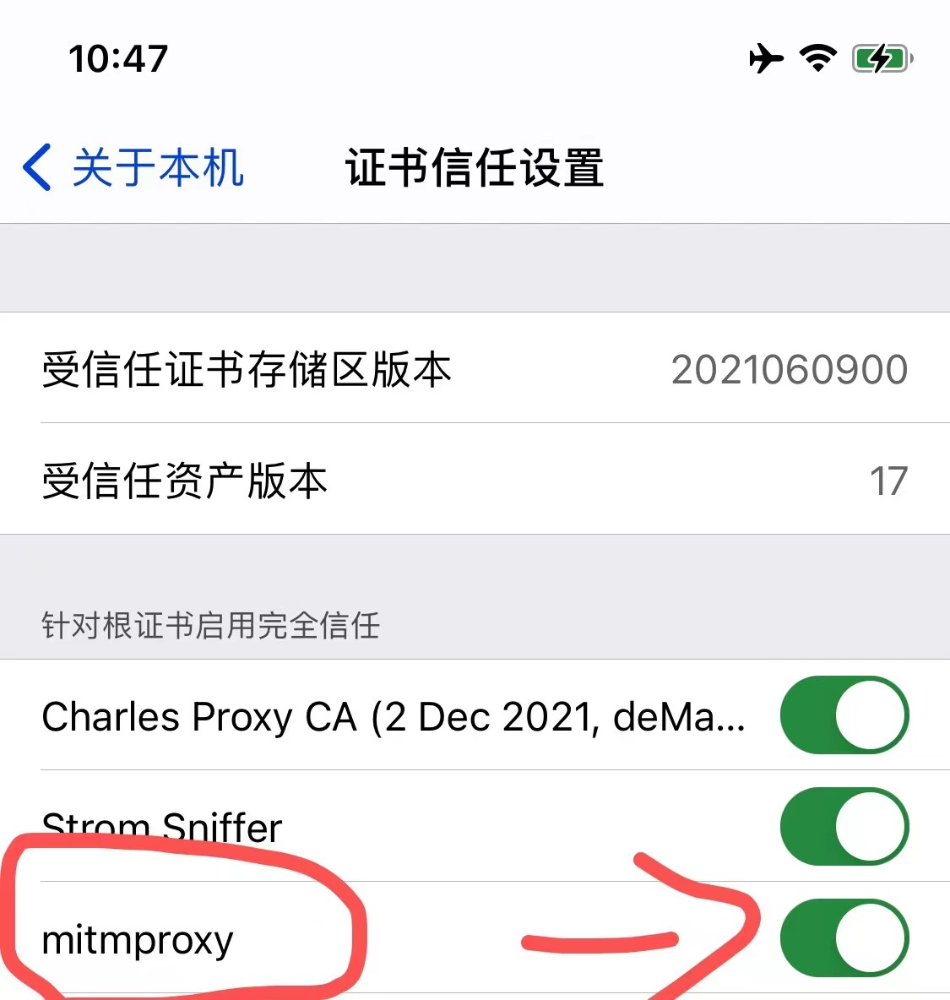

```go
❏ iOS系统:
·设置WiFi - HTTP手动代理
  服务器: 106.53.99.58
  端  口: 5800
·安装证书并信任证书
·打开京东APP
·浏览京东，随便刷刷
·如果成功了！机器人会自动发送信息给你！！

❏ ♨️iOS Socks:
·iOS系统自行寻找能使用socks的代理软件，例如(kitsunebi)
·安装后打开右上角->添加节点->手动添加->协议:socks
  服务器: 106.53.99.58
  端  口: 5800
·保存->选择添加的节点->启动代理
·打开京东APP
·浏览京东，随便刷刷
·如果成功了！机器人会自动发送信息给你！！

以上两种代理方式请注意看说明
‼️最后记得把WiFi代理关闭‼️
‼️最后记得把WiFi代理关闭‼️
‼️最后记得把WiFi代理关闭‼️
```

# 4、成功截图

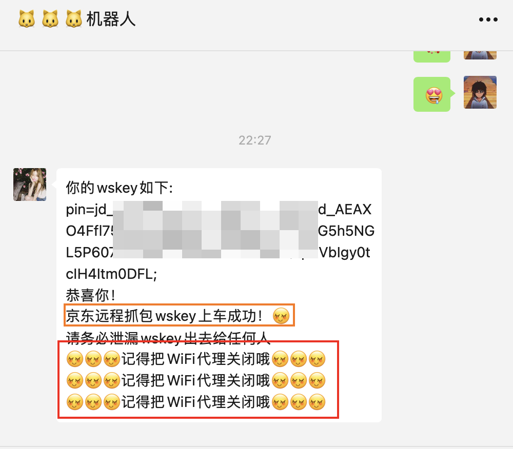

# 6、注意事项

-   本项目需要wifi才能玩！
-   不能开启开启vpn（会抓包无效）
-   配置成功时候，需要多刷新京东app，多浏览机器人才有反应
-   成功之后，浏览别的东西没有反应（蠢哦！那是因为你没有关闭抓包代理！赶紧去关闭它吧！不然你刷以京东app无关的东西都会没有反应！！！）
